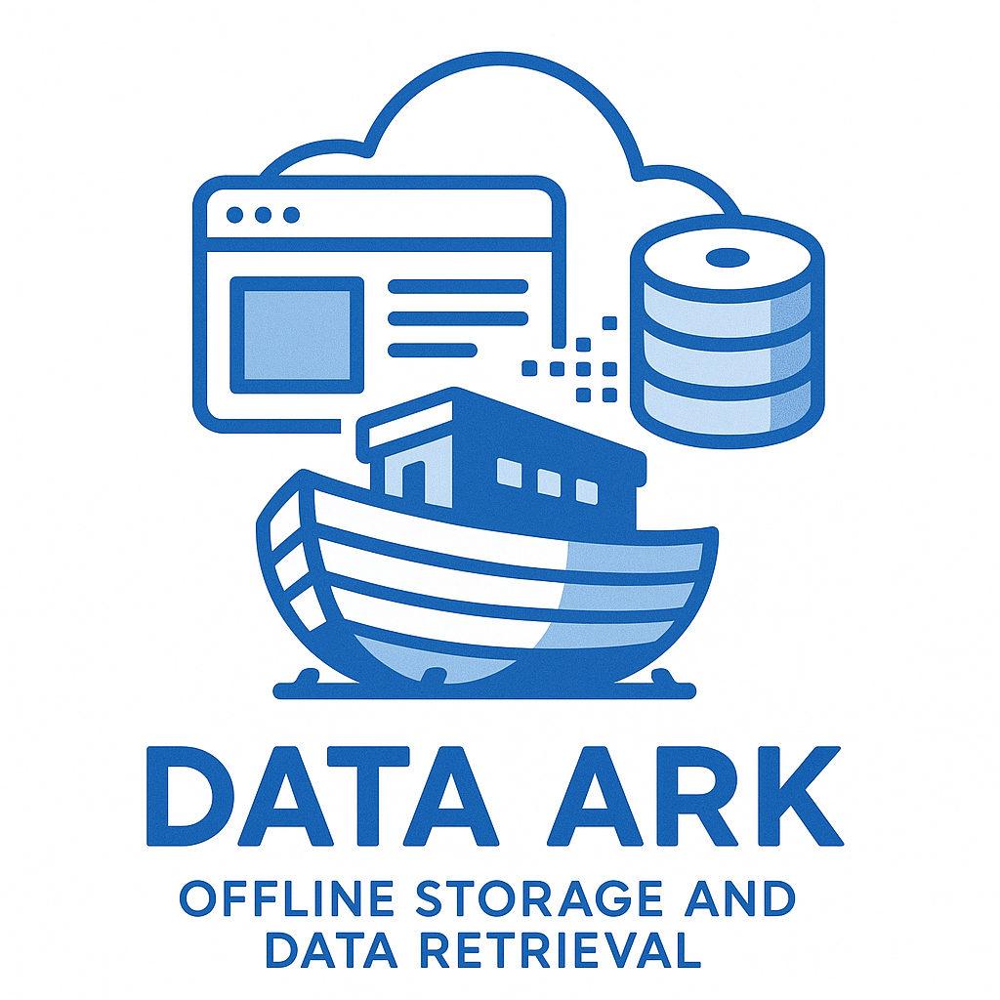

# DataArk
<div align="center">
    
</div>

**DataArk** is an offline storage and data retrieval system designed to save web pages and other data from the Internet that may become inaccessible. Currently, only HTML web page file storage and indexing are supported, with plans to support images, videos, and other file types in the future.
## Middleware
Search Engine: [Meilisearch](https://github.com/meilisearch/meilisearch)

HTML Download: [SingleFile](https://github.com/gildas-lormeau/SingleFile)

## Installation/Deployment
**Using Docker Compose (Recommended)**
```
cd docker
sudo docker compose build
sudo docker compose up -d
```
When starting for the first time, an initial username and password will be generated. Please run the command `sudo docker compose logs` to view the default username and password in the output. This is only output the first time the system is deployed.

**Using `make` to build**
```
make web
make build
```
An executable file will be generated in the `api/bin` directory. After deploying Meilisearch and PostgreSQL, start the service by running:
```
./api/bin/DataArk.exe -loc ./docker/archive \
                      -mhost "http://meili:7700" \
                      -mkey "RandomKey" \
                      -dbhost "127.0.0.1" \
                      -dbport "5432" \
                      -dbname "postgres" \
                      -dbuser "postgres" \
                      -dbpasswd "postgres" \
```


## Feedback and Contributions

Suggestions and feedback are welcome via Issues, or you can directly submit a PR to participate in project development.